# Showcase gallery · 16 prebuilt visual demos

Sample matrix from the 9-scene × 18-philosophy cross-product, weighted
toward the maintainer's game / web3 IP-track. All 16 PNGs were generated
fresh via Codex CLI + gpt-image-2 (codex-cli 0.130.0, OAuth) and imported
through `scripts/codex-image-import.py`. The strip-then-scan gate stripped
the C2PA / JUMBF `caBX` chunk (~23–26 KB per file), re-ran `scan_assets.py`
on the stripped output, and recorded a per-file audit-trail entry in
[`PROVENANCE.md`](PROVENANCE.md) (source generator · Codex session id · full
prompt + prompt SHA-256 · source PNG SHA-256 · output PNG SHA-256 ·
stripped chunks · post-strip stego-scan result · final status).

> **This README is the navigation surface — preview, scene × philosophy
> mapping, brief topic per cell.** The audit trail lives in
> `PROVENANCE.md`. Read this for discovery; read PROVENANCE for forensic
> integrity.

For the philosophy / scene catalogs themselves, see:
- `references/design-styles.md` — 18 design philosophies (§01–14 author-original, §15–18 game/web3 carry-over)
- `references/scene-templates.md` — 9 output-type templates (§01–05 author-original, §06–09 game/web3 carry-over)

---

## 01 — Deck cover · Editorial-identity

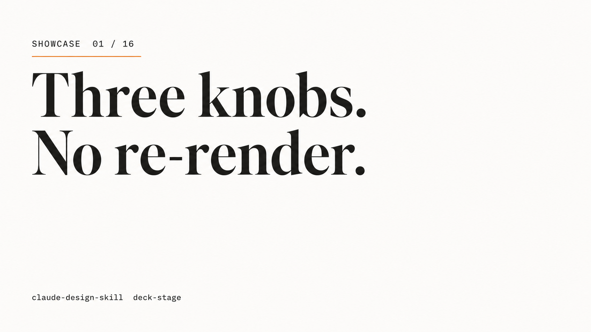

**Scene** §01 Deck cover slide / hero · **Philosophy** §01 Editorial-identity (Pentagram / Build / Atlas lineage)
Topic: a generic minimalist deck cover. Headline reads `Three knobs. / No re-render.`; eyebrow `SHOWCASE 01 / 16`; warm-white background; one off-orange (#d97706) hairline rule under the eyebrow.

---

## 02 — Deck cover · Atmospheric gradient

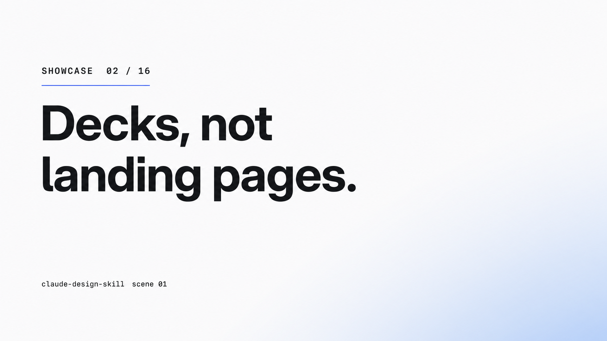

**Scene** §01 Deck cover slide / hero · **Philosophy** §08 Atmospheric gradient (Vercel 2024 / OpenAI / Anthropic)
Topic: a tech-launch-style deck cover. Headline `Decks, not / landing pages.`; cool-blue diffuse gradient originates from the bottom-right corner (under 30 % of the frame); blue (#2563eb) hairline accent under the eyebrow only. Foreground type stays opaque.

---

## 03 — Mid-deck content · Neo-grotesque utility

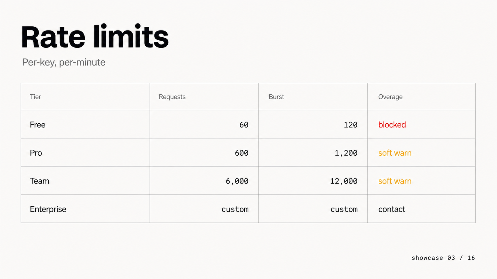

**Scene** §02 Mid-deck content slide · **Philosophy** §02 Neo-grotesque utility (Stripe / Linear / Vercel docs)
Topic: a developer-facing rate-limit reference page. Heading `Rate limits` top-left, subheading `Per-key, per-minute`; 4-row hairline-bordered table (Tier · Requests · Burst · Overage); only state colors (red `blocked`, amber `soft warn`) light up the otherwise-monochrome layout.

---

## 04 — Mid-deck content · Data-dense ledger

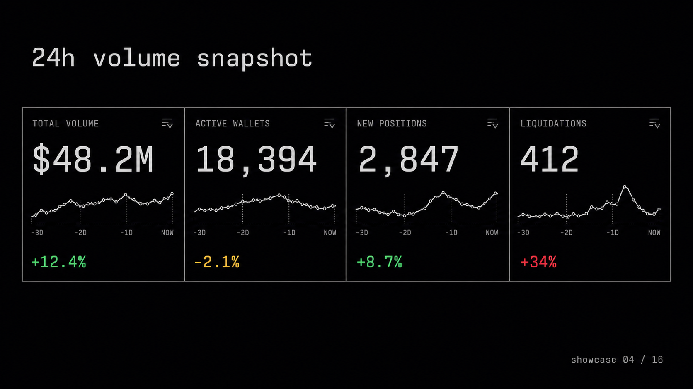

**Scene** §02 Mid-deck content slide · **Philosophy** §07 Data-dense ledger (Bloomberg / DefiLlama / Polymarket)
Topic: a 24-hour metric snapshot. 4 horizontal KPI tiles (TOTAL VOLUME · ACTIVE WALLETS · NEW POSITIONS · LIQUIDATIONS), each with big tabular numerals + 3-day sparkline + delta with state color (green / amber / red). Off-black background, monospace tabular numerals throughout.

---

## 05 — Web hero · Editorial-spatial cinematic

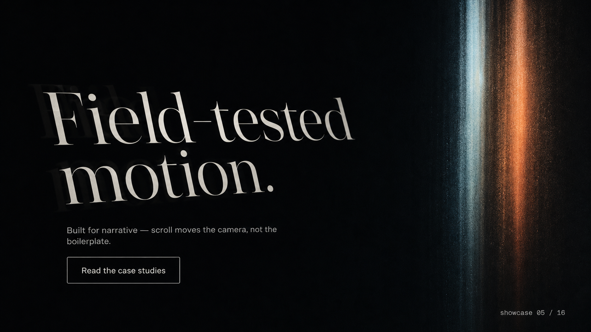

**Scene** §03 Web hero with motion · **Philosophy** §04 Editorial-spatial cinematic (Active Theory / Field.io / Resn)
Topic: a brand-microsite hero in a static frame from a kinetic sequence. Display headline `Field-tested / motion.` left-anchored with diagonal drift offset; lede `Built for narrative — scroll moves the camera, not the boilerplate.`; right column carries a single film-grain depth stripe instead of a gradient mesh.

---

## 06 — Web hero · Kinetic typographic poster

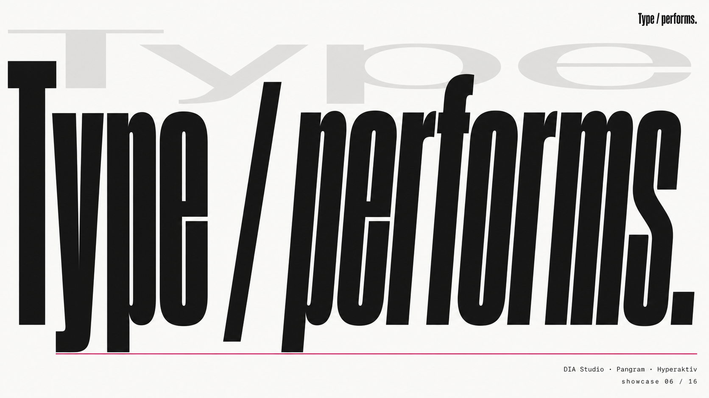

**Scene** §03 Web hero with motion · **Philosophy** §13 Kinetic typographic poster (DIA Studio / Pangram Pangram / Hyperaktiv)
Topic: a type-led brand reveal. `Type / performs.` in extreme variable-font weight occupies almost the full canvas; a ghost rendition of `Type` in a lighter / wider variable axis sits semi-transparent behind, suggesting the morph. One magenta (#ec4899) hairline stripe under the hero; warm-white background.

---

## 07 — Infographic · Data-dense ledger (vertical)

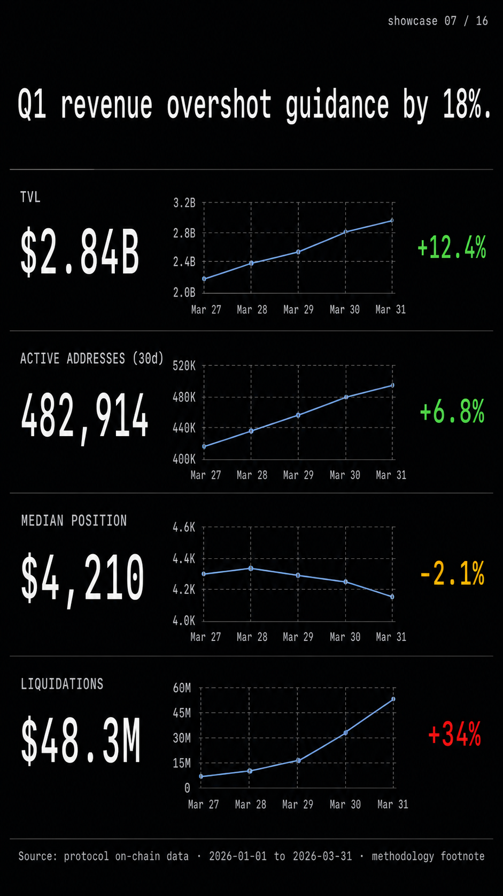

**Scene** §04 Infographic / data narrative · **Philosophy** §07 Data-dense ledger
Topic: a Q1 protocol-revenue snapshot in 1080×1920 vertical. Top thesis `Q1 revenue overshot guidance by 18%.`; 4 stacked metric rows (TVL · ACTIVE ADDRESSES · MEDIAN POSITION · LIQUIDATIONS), each with label + tabular number + sparkline + delta state color; citation footer `Source: protocol on-chain data · 2026-01-01 to 2026-03-31 · methodology footnote`.

---

## 08 — Infographic · Print-translation editorial

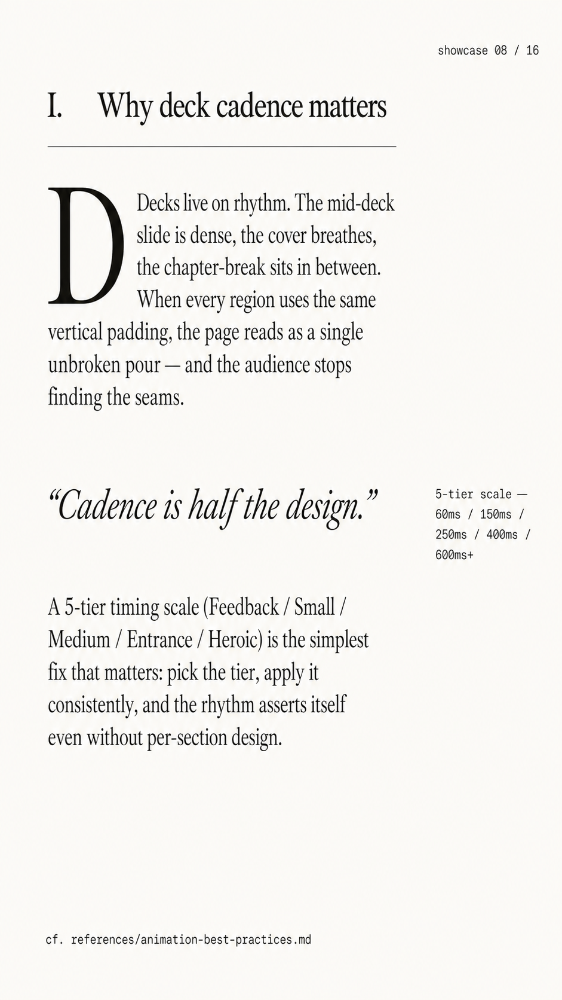

**Scene** §04 Infographic / data narrative · **Philosophy** §06 Print-translation editorial (New Yorker / The Pudding / NYT magazine)
Topic: an essay-format infographic in 1080×1920 vertical. Roman numeral `I.` + chapter title `Why deck cadence matters`; serif drop cap `D` opens the body; italic serif pull-quote `"Cadence is half the design."`; side-margin note `5-tier scale — 60ms / 150ms / 250ms / 400ms / 600ms+`; citation footer `cf. references/animation-best-practices.md`.

---

## 09 — Mobile app screen · Apple-system glass

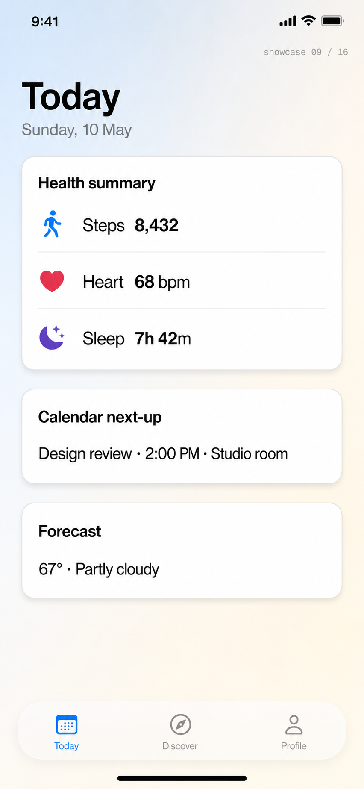

**Scene** §05 Mobile app screen mock · **Philosophy** §05 Apple-system glass (HIG iOS 18 / macOS Sonoma)
Topic: an iOS 18 Today screen. Status bar `9:41`; large `Today` title + `Sunday, 10 May`; 3 opaque rounded cards (Health summary 3 stats · Calendar next-up `Design review · 2:00 PM · Studio room` · Forecast `67° · Partly cloudy`); native-feel bottom tab bar with `Today` selected (SF blue); home indicator pill; pale ambient gradient background.

---

## 10 — Mobile app screen · Soft-tactile / paper-like

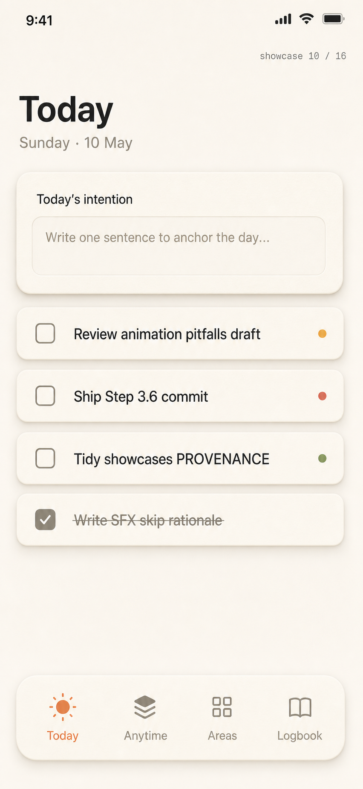

**Scene** §05 Mobile app screen mock · **Philosophy** §09 Soft-tactile / paper-like (Things 3 / Notion 2024 / Maven)
Topic: a productivity / journaling Today screen. Large `Today` + `Sunday · 10 May` sub; intention input card on paper-like beige; 4 task rows (3 incomplete with priority dots amber / red / green, 1 completed with strike-through); bottom tab bar `Today / Anytime / Areas / Logbook` with `Today` selected (muted-orange).

---

## 11 — Game HUD · Diablo / Destiny / Genshin

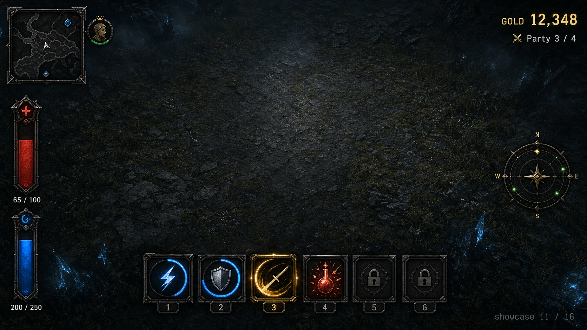

**Scene** §06 Game HUD overlay · **Philosophy** §15 Game HUD
Topic: an in-game HUD overlay. Edge-anchored chrome only — top-left mini-map + party portrait, top-right `GOLD 12,348` + `× Party 3 / 4`, bottom action bar with 6 ability slots (cooldown radial arc · golden-ring active · sharp ready · greyed locked), left vertical health red `65 / 100` + mana blue `200 / 250`, right radial compass minimap. Center kept clear for gameplay.

---

## 12 — Game HUD · High-contrast graphic poster (Bauhaus cross)

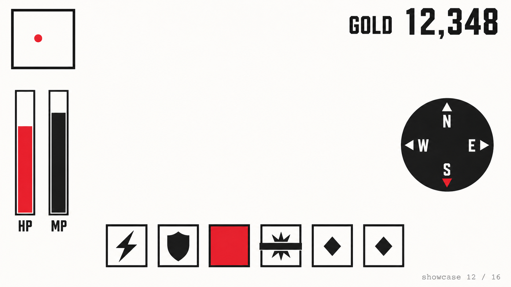

**Scene** §06 Game HUD overlay · **Philosophy** §10 High-contrast graphic poster (Bauhaus / MoMA / Verso Books)
Topic: a counter-cultural take on the same scene — game HUD rendered in 3-color discipline (off-white · off-black · single vivid red), hard squares only, no glow / gradient. Demonstrates that the same scene can ship under radically different philosophies without re-prompting.

---

## 13 — NFT marketplace card grid

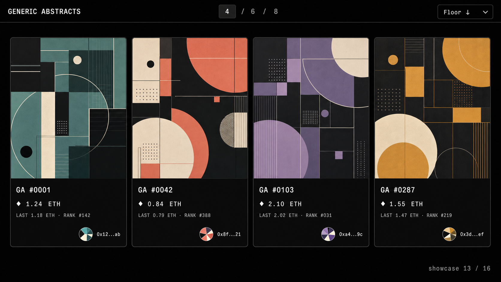

**Scene** §07 NFT marketplace card / collection grid · **Philosophy** §17 NFT Marketplace (OpenSea / Blur / Magic Eden)
Topic: a 4-up NFT collection grid in dark mode. Top toolbar (`GENERIC ABSTRACTS` · density `4 / 6 / 8` selector with 4 active · `Floor ↓` sort); 4 cards each split 70 / 30 (abstract artwork in distinct muted palettes / title + floor + last + rank + jazzicon avatar). Near-black `#0E0E10` canvas.

---

## 14 — NFT collection landing · Web3 Minimalism

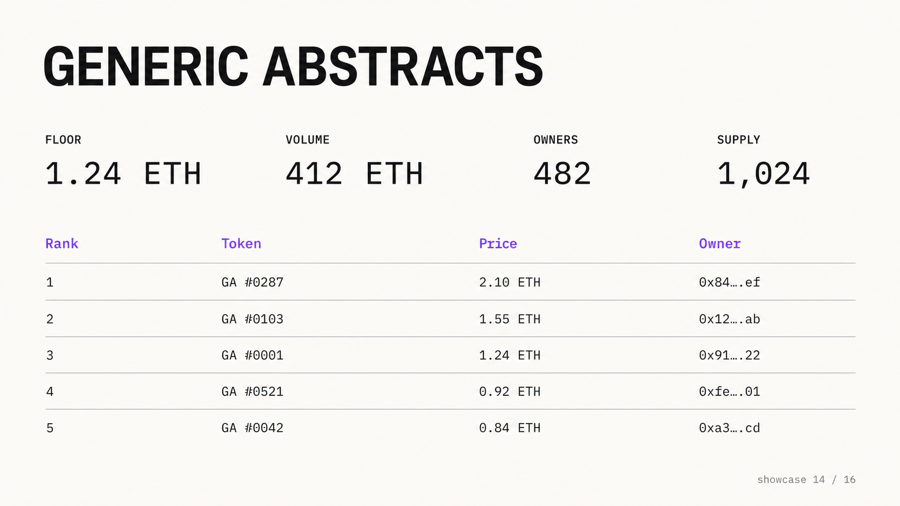

**Scene** §07 NFT marketplace card / collection grid · **Philosophy** §16 Web3 Minimalism (Uniswap / Lens / Farcaster)
Topic: a type-first NFT collection landing page. Large `GENERIC ABSTRACTS` display; 4 stat tiles with no chrome (FLOOR · VOLUME · OWNERS · SUPPLY); 5-row hairline table (Rank · Token · Price · Owner with truncated `0x…` addresses); single purple (#8b5cf6) accent only on the column headers. Anti-skeuomorphism — no shadows, no gradients, no glass.

---

## 15 — Wallet · DEX swap (Web3 Minimalism)

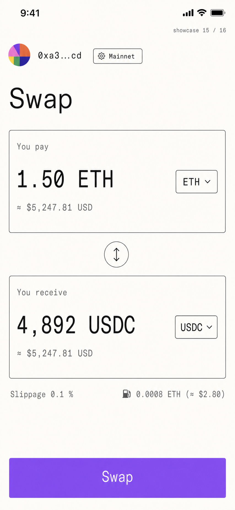

**Scene** §08 Wallet / DEX interface · **Philosophy** §16 Web3 Minimalism
Topic: a Uniswap-style mobile swap. Identity row (jazzicon + truncated `0xa3…cd` + `Mainnet` badge); `Swap` title; You-pay card `1.50 ETH ≈ $5,247.81` + ETH selector; vertical `↕` swap-arrow; You-receive card `4,892 USDC` + USDC selector; slippage + network fee row; full-width purple `Swap` primary action.

---

## 16 — Onboarding · Game-loop step 3 / 7

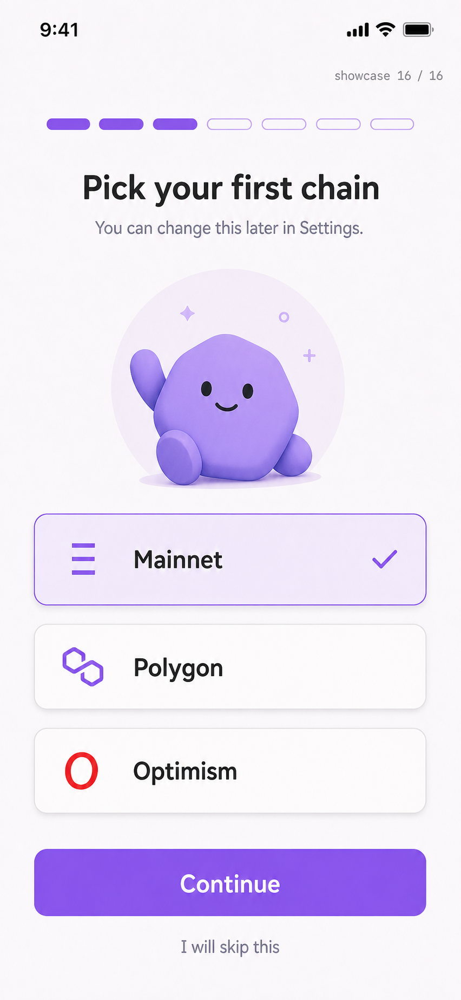

**Scene** §09 Onboarding game-loop · **Philosophy** §18 Onboarding-Game-Loop (Duolingo / Phantom / Rainbow / Coinbase Wallet)
Topic: a wallet onboarding step 3 of 7 — `Pick your first chain`. Progress pill row (3 filled soft-purple · 4 outline); friendly geometric mascot on a pale-purple circle; 3 chain cards (Mainnet selected purple-bordered + ✓ · Polygon hairline · Optimism hairline); full-width purple `Continue` primary action; soft-purple-tinted warm-white background.

---

## How this catalog is regenerated

If a cell's prompt or aesthetic anchor changes (e.g. `references/design-styles.md`
adds a new philosophy that should be sampled here), regenerate the affected
cell only — do not re-run all 16. Per-cell regeneration:

```bash
codex exec --skip-git-repo-check "<the prompt block from the cell — see PROVENANCE.md for the full text>"
python3 scripts/codex-image-import.py \
    --brand showcase \
    --name <NN-cell-slug> \
    --prompt "<short prompt summary>" \
    --assets-root assets
```

The importer auto-picks the most recent PNG from
`~/.codex/generated_images/<session-id>/`, runs the strip-then-scan gate,
moves the cleaned PNG into `assets/showcase-brand/generated/<NN-cell-slug>.png`,
and appends a fresh entry to `PROVENANCE.md`.

The `<brand>-brand/generated/` carrier directory is the
`scripts/codex-image-import.py` path convention — `assets/showcase-brand/`
is the conceptual `assets/showcases/` named in `HANDOFF.md §7.6`.

## See also

- [`PROVENANCE.md`](PROVENANCE.md) — per-file audit trail (sha256, stripped chunks, stego-scan result)
- `references/design-styles.md` — the 18-direction philosophy catalog
- `references/scene-templates.md` — the 9 output-type templates
- `SKILL.md ## App prototype rules` / `## Slide deck conventions` — caller-side rules these showcases illustrate
